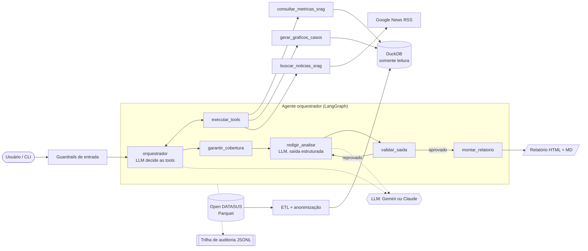

# SRAG Insight Agent

Prova de Conceito (PoC) da **Indicium HealthCare** de uma solução de IA Generativa que gera,
de forma automatizada, relatórios sobre **Síndrome Respiratória Aguda Grave (SRAG)**. Um agente
orquestrador consulta o banco de dados oficial do SIVEP-Gripe ([Open DATASUS](https://dadosabertos.saude.gov.br/dataset/srag-2019-a-2026)),
calcula as métricas, gera os gráficos e busca notícias em tempo real para explicar o cenário atual.

- 📄 **Diagrama da arquitetura (PDF):** [`docs/arquitetura.pdf`](docs/arquitetura.pdf)
- 📊 **Exemplo de relatório gerado:** [`docs/exemplo-relatorio/relatorio.md`](docs/exemplo-relatorio/relatorio.md)
  (com a [trilha de auditoria](docs/exemplo-relatorio/auditoria.jsonl) da mesma execução)

O relatório traz as quatro métricas pedidas (taxa de aumento de casos, taxa de mortalidade,
taxa de ocupação de UTI e taxa de vacinação), os dois gráficos (casos diários dos últimos
30 dias e mensais dos últimos 12 meses), uma análise interpretativa, as notícias usadas
como fonte e a metodologia.

---

## Sumário

1. [Arquitetura](#arquitetura)
2. [Decisões de projeto](#decisões-de-projeto)
3. [Dados e tratamento](#dados-e-tratamento)
4. [Métricas](#métricas)
5. [Guardrails](#guardrails)
6. [Governança e transparência](#governança-e-transparência)
7. [Tratamento de dados sensíveis](#tratamento-de-dados-sensíveis)
8. [Como executar](#como-executar)
9. [Qualidade de código e testes](#qualidade-de-código-e-testes)
10. [Estrutura do repositório](#estrutura-do-repositório)
11. [Limitações e próximos passos](#limitações-e-próximos-passos)

---

## Arquitetura

O agente é um grafo [LangGraph](https://langchain-ai.github.io/langgraph/) com um nó
orquestrador (LLM com *function calling*), três tools e etapas determinísticas de controle.
O diagrama completo, com LLM, banco de dados, fonte de notícias e auditoria, está em
[`docs/arquitetura.pdf`](docs/arquitetura.pdf).



| Componente | Responsabilidade | Código |
|---|---|---|
| **Orquestrador** | LLM recebe as tools e decide quais chamar (normalmente as três, em paralelo) | [`agent.py`](src/srag_agent/agent.py) |
| **Tools** | `consultar_metricas_srag`, `gerar_graficos_casos`, `buscar_noticias_srag` | [`tools.py`](src/srag_agent/tools.py) |
| **Cobertura** | Executa de forma determinística qualquer tool obrigatória que o LLM não tenha chamado | [`agent.py`](src/srag_agent/agent.py) |
| **Redator** | LLM escreve a análise em formato estruturado (Pydantic) | [`analysis.py`](src/srag_agent/analysis.py), [`prompts.py`](src/srag_agent/prompts.py) |
| **Validação de saída** | Confere números, citações, injeção e PII; reprovação gera nova tentativa com o motivo | [`guardrails.py`](src/srag_agent/guardrails.py) |
| **Relatório** | Monta tabelas, gráficos e fontes a partir dos dados (não do texto do LLM) | [`report.py`](src/srag_agent/report.py) |
| **LLM** | Interface única com adaptadores para Gemini e Claude | [`llm/`](src/srag_agent/llm) |
| **Auditoria** | Log JSONL append-only por execução | [`audit.py`](src/srag_agent/audit.py) |

## Decisões de projeto

- **O LLM decide e interpreta, mas não calcula.** Todas as métricas e séries saem de SQL
  fixo e parametrizado. O LLM escolhe quais tools chamar e escreve a interpretação, e o
  relatório final monta tabelas e gráficos a partir dos dados guardados no `RunContext`.
  Assim, um erro do modelo não altera nenhum número oficial.
- **Agente com trilhos determinísticos.** O orquestrador tem autonomia para chamar as tools,
  mas o grafo garante a cobertura mínima (tools obrigatórias), limita o número de passos e
  só publica texto aprovado pela validação. É o equilíbrio entre a flexibilidade de um
  agente e a previsibilidade exigida em saúde.
- **Interface de LLM independente de provedor.** O padrão é o **Google Gemini**, que tem
  plano gratuito, com modelo reserva (`gemini-3.8-flash` → `gemini-3.5-flash-lite`) quando o
  principal está sobrecarregado. A **Claude** (Anthropic) é alternativa, configurável por
  variável de ambiente. Os dois adaptadores usam os SDKs oficiais, com chamada manual de
  funções: o agente executa e audita cada tool, em vez de deixar o SDK executá-las sozinho.
- **DuckDB + Parquet.** O portal publica os dados em Parquet (25 MB contra 364 MB do CSV).
  O DuckDB lê Parquet nativamente, faz agregações analíticas em milissegundos, roda sem
  servidor e abre em **modo somente leitura** para o agente.
- **Atraso de notificação tratado explicitamente.** Os casos mais recentes ainda estão sendo
  digitados no SIVEP-Gripe (os últimos dias da base têm poucas dezenas de casos, contra cerca de
  500 por dia). As métricas usam uma **data de referência = última digitação − 14 dias**, e
  os gráficos destacam o período incompleto. Sem isso, o relatório mostraria uma queda que não
  existe.
- **Notícias via Google News RSS.** Gratuito, sem chave e com notícias do dia (InfoGripe/Fiocruz,
  secretarias, imprensa regional). A consulta é fixa e o conteúdo é tratado como não confiável.

## Dados e tratamento

**Fonte:** dataset [SRAG 2019 a 2026](https://dadosabertos.saude.gov.br/dataset/srag-2019-a-2026)
do Open DATASUS, arquivos Parquet de **2025 e 2026** (cobrem os últimos 12 meses), e o
dicionário de dados oficial.

| Etapa | Resultado na base atual |
|---|---|
| Linhas brutas | 557.361 |
| Duplicatas removidas (nº notificação + município + data) | 0 |
| Removidas por datas incoerentes (sintomas após notificação/digitação) | 101 |
| **Linhas finais** | **557.260** |
| Sem informação de evolução / UTI / vacina COVID | 55.717 / 59.757 / 6.278 |

**Colunas selecionadas** (21 de 194, allowlist em [`etl.py`](src/srag_agent/data/etl.py)):
datas (sintomas, notificação, digitação, internação, UTI, evolução), UF de notificação e de
residência, sexo, idade (convertida em faixa), hospitalização, UTI, suporte ventilatório,
classificação final, evolução e vacinação (COVID-19 e gripe).

**Tratamentos aplicados:**
- Códigos do dicionário viram rótulos legíveis; `9-Ignorado` e vazios viram `NULL` (não são
  contados como "não").
- Datas de internação, UTI e evolução fora do intervalo [início dos sintomas, digitação] são
  anuladas; registros com início dos sintomas inválido são descartados.
- Códigos numéricos que chegam como texto ou decimal (`'1'`, `1.0`) são normalizados.
- Identificador `case_id` determinístico (o mesmo caso recebe sempre o mesmo id).
- Cada regra é contabilizada nas tabelas `etl_quality` e `etl_metadata`.

## Métricas

Todas são calculadas por **data de início dos sintomas** até a data de referência e trazem
numerador, denominador, período, definição e limitações no relatório.

| Métrica | Definição | Janela | Limitação declarada |
|---|---|---|---|
| **Taxa de aumento de casos** | (casos da última semana − semana anterior) ÷ semana anterior | 7 + 7 dias | A semana mais recente ainda pode ser revisada para cima |
| **Taxa de mortalidade** | óbitos por SRAG ÷ casos com desfecho conhecido (cura, óbito por SRAG, óbito por outras causas) | 90 dias | É letalidade entre casos notificados, não mortalidade populacional; % de casos ainda sem desfecho é informado |
| **Taxa de ocupação de UTI** | internados em UTI ÷ hospitalizados com a informação preenchida | 30 dias | **Proxy**: a base não informa a capacidade de leitos |
| **Taxa de vacinação** | casos vacinados contra COVID-19 ÷ casos com a informação (gripe informada à parte) | 30 dias | Refere-se apenas a quem teve SRAG, não à cobertura da população |

Os relatórios podem ser gerados para o Brasil ou para qualquer UF (`--uf SP`).

## Guardrails

| Camada | Controle | Onde |
|---|---|---|
| **Entrada** | UF validada contra lista fechada; foco opcional limitado a 300 caracteres, restrito ao tema SRAG, sem padrões de *prompt injection* e sem dados pessoais. Pedido inválido é bloqueado **antes** de qualquer chamada ao LLM. | `guardrails.validate_request` |
| **Dados** | Banco aberto em modo somente leitura; consultas SQL fixas e parametrizadas; o LLM nunca escreve SQL nem texto de busca (argumento das tools é uma enumeração de UFs). | `db.py`, `metrics.py`, `tools.py` |
| **Tools** | Schema estrito; tool desconhecida ou argumento inválido vira erro devolvido ao LLM; limite de passos do orquestrador; cobertura obrigatória das três tools. | `tools.execute_tool`, `agent.ensure_coverage` |
| **Conteúdo externo** | Notícias com padrões de injeção são descartadas (e registradas); PII mascarada; o texto chega ao LLM marcado como `<noticias_nao_confiaveis>`. | `guardrails.screen_news` |
| **Saída** | Todo **percentual e toda contagem** citados precisam bater com os dados calculados ou com as fontes; ids de notícias citadas precisam existir; texto sem instruções; mascaramento de PII. Se reprovar, o LLM reescreve com o motivo (até 2 tentativas); persistindo, o relatório sai com aviso explícito. | `agent.validate_output` |
| **Resiliência** | Modelo reserva quando o principal está sobrecarregado (Gemini) ou recusa a requisição (Claude); falha na busca de notícias não derruba o relatório. | `llm/gemini.py`, `llm/claude.py` |

> A validação de contagens nasceu de um caso real: na primeira execução, o modelo escreveu
> "2021 casos em agosto" quando o valor era 20.021. Esse caso virou teste automatizado.

## Governança e transparência

Cada execução gera `logs/audit/<run_id>.jsonl`, append-only, com sequência e horário de
cada evento:

| Evento | Conteúdo |
|---|---|
| `run_started` | pedido validado, provedor, modelo, atraso de notificação considerado |
| `llm_call` | finalidade (orquestrador, redator), modelo pedido e efetivo, motivo de parada, tokens, **hash SHA-256 do prompt** e do payload |
| `agent_decision` | quais tools o orquestrador decidiu chamar e com quais argumentos |
| `tool_call` / `tool_result` / `tool_error` | argumentos, duração e resultado de cada tool |
| `guardrail` | decisão (aprovado, rejeitado, execução forçada), motivo e problemas encontrados |
| `llm_fallback` | troca de modelo por sobrecarga, com o motivo |
| `report_rendered` / `run_finished` / `run_failed` | artefatos gerados ou erro |

Trecho real ([auditoria completa](docs/exemplo-relatorio/auditoria.jsonl)):

```text
 2 llm_call        orchestrator     gemini-3.8-flash   stop=STOP in=961 out=62
 3 agent_decision  orchestrator     consultar_metricas_srag, gerar_graficos_casos, buscar_noticias_srag (BR)
 ...
12 llm_fallback    writer_attempt_1 gemini-3.8-flash -> gemini-3.5-flash-lite (HTTP 503)
13 llm_call        writer_attempt_1 gemini-3.5-flash-lite stop=STOP
14 guardrail       output_validation approved
```

O próprio relatório informa o modelo usado, a data de corte da base, a data de referência
das métricas, o id da execução e o caminho do log de auditoria. Os prompts ficam
versionados em [`prompts.py`](src/srag_agent/prompts.py).

## Tratamento de dados sensíveis

- **Minimização:** o ETL lê apenas 21 das 194 colunas. Nunca chegam ao banco: número da
  notificação, data de nascimento, município, unidade de saúde, ocupação, lotes de vacina,
  campos de texto livre e qualquer outro campo fora da allowlist. Um teste automatizado
  garante isso.
- **Generalização:** idade exata vira faixa etária; localização fica restrita à UF.
- **Agregação:** o LLM recebe apenas contagens e proporções, nunca registros individuais.
- **Conteúdo externo e saída:** CPF, cartão SUS, e-mail e telefone são mascarados nas
  notícias, nos pedidos e no texto final.
- **Segredos e dados fora do Git:** dados brutos, banco, logs e `.env` estão no `.gitignore`;
  as chaves de API são lidas como `SecretStr` e nunca são registradas.
- **Provedor gratuito:** no plano gratuito do Gemini, o Google pode usar o conteúdo enviado
  para melhorar seus produtos. Por isso o desenho envia ao LLM apenas agregados públicos e
  manchetes, sem nenhum dado individual. Para uso em produção, recomenda-se um plano pago
  ou a Claude, que não usa os dados da API para treinamento.

## Como executar

**Requisitos:** Python 3.11+ e uma chave gratuita do Google AI Studio
(https://aistudio.google.com/apikey), ou uma chave da Anthropic.

```bash
python -m venv .venv
.venv\Scripts\activate            # Linux/macOS: source .venv/bin/activate
pip install -e ".[dev]"
copy .env.example .env            # Linux/macOS: cp .env.example .env
```

Preencha `GEMINI_API_KEY` no `.env`. Para usar a Claude, defina
`SRAG_LLM_PROVIDER=claude` e `ANTHROPIC_API_KEY`.

```bash
python -m srag_agent.data.download     # baixa os Parquet de 2025/2026 e o dicionário (~43 MB)
python -m srag_agent.data.etl          # gera data/processed/srag.duckdb
python -m srag_agent                   # relatório do Brasil
python -m srag_agent --uf SP           # relatório de uma UF
python -m srag_agent --uf RJ --foco "Como está a pressão sobre UTIs pediátricas?"
```

O relatório é salvo em `outputs/<run_id>/relatorio.html` (e `.md`, com os gráficos PNG), e a
auditoria em `logs/audit/<run_id>.jsonl`.

**Configuração** (variáveis no `.env`, todas opcionais exceto a chave):

| Variável | Padrão | Descrição |
|---|---|---|
| `SRAG_LLM_PROVIDER` | `gemini` | `gemini` ou `claude` |
| `SRAG_LLM_MODEL` | `gemini-3.8-flash` / `claude-opus-5-5` | modelo principal |
| `SRAG_LLM_FALLBACK_MODEL` | `gemini-3.5-flash-lite` | modelo reserva (Gemini) |
| `SRAG_LLM_EFFORT` | `medium` | profundidade de raciocínio (Claude) |
| `SRAG_REPORTING_LAG_DAYS` | `14` | dias excluídos por atraso de notificação |
| `SRAG_MAX_AGENT_STEPS` | `8` | limite de iterações do orquestrador |
| `SRAG_SOURCE_FILES` | arquivos de 2025 e 2026 | nomes dos Parquet no portal (mudam a cada atualização) |

## Qualidade de código e testes

```bash
pytest          # 38 testes, sem chamadas reais a LLM
ruff check src tests && ruff format --check src tests
```

- **ETL:** colunas sensíveis nunca chegam ao banco, idade vira faixa, datas inválidas são
  tratadas e os códigos são decodificados.
- **Métricas:** valores conferidos contra uma base sintética com contagens conhecidas, filtro
  por UF, exclusão do período em atraso e marcação de períodos incompletos.
- **Guardrails:** injeção, PII, percentuais e contagens não verificados, pedidos inválidos e
  triagem de notícias.
- **Agente ponta a ponta:** o grafo completo roda com clientes simulados **do Gemini e da
  Claude**, cobrindo a cobertura forçada de tool, a reprovação seguida de revisão, o descarte
  de notícia maliciosa e a auditoria.
- **Resiliência:** troca para o modelo reserva quando o principal responde 503.

## Estrutura do repositório

```text
srag-insight-agent/
├── docs/
│   ├── arquitetura.pdf          # diagrama conceitual (entrega)
│   ├── arquitetura.html         # fonte do diagrama
│   └── exemplo-relatorio/       # relatório real + auditoria da execução
├── src/srag_agent/
│   ├── __main__.py              # CLI
│   ├── agent.py                 # grafo LangGraph (orquestrador e controles)
│   ├── tools.py                 # tools do agente + RunContext
│   ├── metrics.py               # métricas e séries (SQL fixo)
│   ├── charts.py                # gráficos
│   ├── news.py                  # Google News RSS
│   ├── guardrails.py            # entrada, conteúdo externo e saída
│   ├── audit.py                 # trilha de auditoria
│   ├── analysis.py              # formato estruturado da análise
│   ├── prompts.py               # prompts versionados
│   ├── report.py                # montagem do relatório
│   ├── llm/                     # interface + adaptadores Gemini e Claude
│   ├── data/                    # download e ETL
│   ├── config.py, db.py, geo.py
└── tests/                       # pytest
```

Para regenerar o PDF do diagrama a partir do HTML (Chrome ou Edge):

```bash
chrome --headless=new --no-pdf-header-footer --print-to-pdf=docs/arquitetura.pdf docs/arquitetura.html
```

## Limitações e próximos passos

- **Ocupação de UTI real:** cruzar com o CNES (leitos de UTI por UF) para calcular ocupação
  propriamente dita, em vez da proxy atual.
- **Cobertura vacinal populacional:** integrar dados do SI-PNI/RNDS para uma taxa de vacinação
  da população, complementando a taxa entre casos.
- **Correção do atraso (*nowcasting*):** estimar os casos ainda não digitados, como faz o
  InfoGripe, em vez de apenas excluir os últimos 14 dias.
- **Comparação sazonal:** comparar com o mesmo período do ano anterior (exige os arquivos de 2024).
- **Notícias:** priorizar fontes oficiais (Fiocruz, Ministério da Saúde, secretarias) e usar
  RAG sobre os boletins do InfoGripe.
- **Operação:** agendamento diário, interface web e armazenamento da auditoria em um banco
  centralizado.

> Este relatório é um apoio à vigilância epidemiológica e não substitui avaliação clínica ou
> boletins oficiais.
