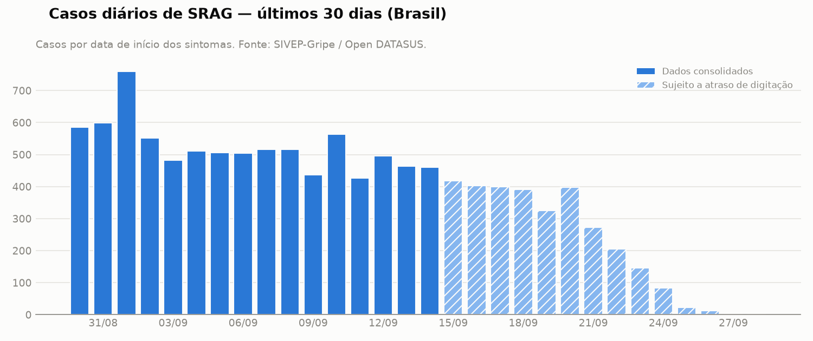
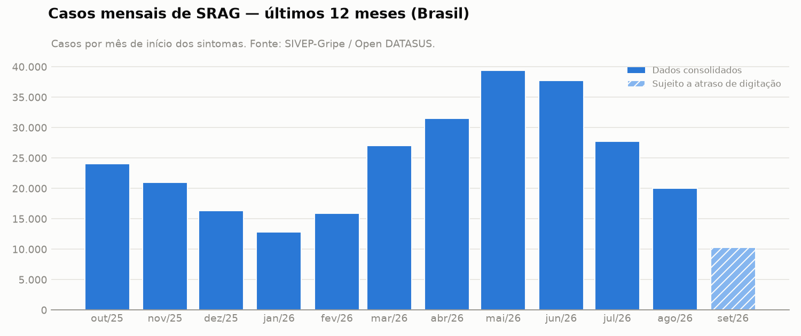

# Relatório de SRAG — Brasil

Gerado em 02/10/2026 02:16 UTC · Base atualizada até 28/09/2026 ·
Métricas até 14/09/2026 · Execução <code>20261002T021541Z-1c9bec0b</code>

## Resumo executivo

O cenário nacional de Síndrome Respiratória Aguda Grave apresenta arrefecimento nos registros recentes após o pico sazonal ocorrido no primeiro semestre de 2026. A taxa de aumento de casos situou-se em -12,2%, refletindo a tendência de queda observada nos últimos meses completos. No entanto, a vigilância epidemiológica permanece atenta devido à circulação contínua de vírus respiratórios e à necessidade de monitorar grupos específicos, como crianças e gestantes. A letalidade hospitalar e a ocupação de leitos de terapia intensiva exigem acompanhamento contínuo pelas equipes de gestão.

## Métricas

| Métrica | Valor | Numerador / denominador | Período (início dos sintomas) |
|---|---|---|---|
| Taxa de aumento de casos | -12,2% | 3.366 / 3.833 | 08/09/2026 a 14/09/2026 |
| Taxa de mortalidade (letalidade hospitalar) | 5,2% | 2.929 / 56.249 | 17/06/2026 a 14/09/2026 |
| Taxa de ocupação de UTI (proxy) | 28,3% | 4.284 / 15.138 | 16/08/2026 a 14/09/2026 |
| Taxa de vacinação (COVID-19) entre casos de SRAG | 39,2% | 6.694 / 17.070 | 16/08/2026 a 14/09/2026 |

<small>As métricas usam dados até 14/09/2026: os 14 dias
mais recentes da base ainda estão sendo digitados no SIVEP-Gripe e foram excluídos para não
confundir atraso de notificação com queda de casos.</small>

### Taxa de aumento de casos: -12,2%

A taxa de aumento de casos atingiu -12,2%, indicando uma variação negativa no número de novas notificações de SRAG na semana mais recente em comparação ao período imediatamente anterior. Esse comportamento sugere recuo nos atendimentos por quadros respiratórios graves, embora os dados recentes estejam sujeitos a revisões por atraso de digitação.

<small>**Como é calculada:** Variação percentual dos casos de SRAG (por data de início dos sintomas) nos últimos 7 dias completos em relação aos 7 dias anteriores. Numerador = casos da semana atual; denominador = semana anterior.</small>

<small>**Limitações:**</small>

- Os últimos 14 dias foram excluídos por atraso de digitação; mesmo assim, a semana mais recente pode ser revisada para cima.

### Taxa de mortalidade (letalidade hospitalar): 5,2%

A taxa de mortalidade (letalidade hospitalar) registrou 5,2% entre os casos com desfecho conhecido no período analisado. O índice mede exclusivamente a proporção de óbitos entre os pacientes hospitalizados por SRAG que tiveram desfecho encerrado, desconsiderando uma parcela de notificações que ainda aguarda fechamento.

<small>**Como é calculada:** Óbitos por SRAG divididos pelos casos com desfecho conhecido (cura, óbito por SRAG ou óbito por outras causas), entre casos com sintomas nos últimos 90 dias completos.</small>

<small>**Limitações:**</small>

- Mede letalidade entre casos notificados de SRAG (majoritariamente hospitalizados), não a mortalidade da população geral.
- 21,4% dos casos do período ainda não têm desfecho registrado.

### Taxa de ocupação de UTI (proxy): 28,3%

A taxa de ocupação de UTI alcançou 28,3%, servindo como uma proxy para mensurar a proporção de internações hospitalares por SRAG que necessitaram de suporte intensivo. Como o sistema não consolida a capacidade total de leitos, o indicador reflete o peso relativo dos casos graves sobre a rede hospitalar.

<small>**Como é calculada:** Proporção dos casos de SRAG hospitalizados que foram internados em UTI, entre casos com sintomas nos últimos 30 dias completos e com a informação de UTI preenchida.</small>

<small>**Limitações:**</small>

- A base não informa a capacidade de leitos; por isso esta é uma proxy da pressão sobre UTIs, não a ocupação de leitos propriamente dita.

### Taxa de vacinação (COVID-19) entre casos de SRAG: 39,2%

A taxa de vacinação contra a COVID-19 entre os casos de SRAG foi de 39,2%, medindo o histórico de imunização exclusivamente na população que desenvolveu a forma grave da doença. Esse dado não reflete a cobertura vacinal da população geral e deve ser interpretado no contexto da proteção parcial observada nos pacientes hospitalizados.

<small>**Como é calculada:** Proporção dos casos de SRAG que receberam ao menos uma dose de vacina contra COVID-19, entre casos com sintomas nos últimos 30 dias completos e com a informação preenchida.</small>

<small>**Limitações:**</small>

- A base contém apenas pessoas que tiveram SRAG; a métrica não representa a cobertura vacinal da população geral.
- Vacinação contra gripe na última campanha entre os mesmos casos: 37,3% (6083 de 16313).

## Evolução dos casos

A análise da série histórica mensal demonstra que os registros iniciaram o ano de 2026 em patamares moderados, com 12.817 casos em janeiro de 2026, avançaram progressivamente até atingir o pico de 39.435 casos em maio de 2026, e iniciaram uma trajetória decrescente nos meses seguintes, marcada por 20.021 casos em agosto de 2026 e um total parcial de 10.277 casos em setembro de 2026 (mês incompleto). Na série diária, os registros oscilaram em torno de quinhentos casos diários no início de setembro de 2026, com reduções subsequentes que refletem o atraso natural no preenchimento e notificação dos dias mais próximos à data de corte.

## Contexto: notícias recentes

As notícias recentes indicam variações regionais na circulação de patógenos, como o aumento de metapneumovírus no Espírito Santo (id 1) e de SRAG em crianças no Rio de Janeiro e Sergipe (id 3). Além disso, há registros de casos e óbitos por influenza em municípios como Campinas (id 6 e id 7) e preocupações expressas sobre a baixa adesão vacinal entre gestantes (id 5, id 8 e id 9), o que reforça a importância das campanhas de imunização.

**Notícias consultadas:**

1. [InfoGripe: Espírito Santo tem alta de metapneumovírus](https://news.google.com/rss/articles/CBMikwFBVV95cUxNSUc1REhEVnNGMFVxUnNXWktpMTVMUXVNNEJTYS1Ga2xRaDNHaUlQd3dqUnktYlhSNzU0aldybVBlekVGWFR0V3hoQ0lPcEtXR1pLb29aN09LaS1OVEFOMGpKcXRqQTJHYTJ3cUpZcnJyQzhHYXFtZW1MbnNsNF81NjFGR1RFOXphOENVcXhaLTlHQTg?oc=5) — Jornal ES HOJE, 01/10/2026 ✱
2. [Acre deixa grupo de estados com alta da SRAG, mas rinovírus e Covid-19 ainda preocupam](https://news.google.com/rss/articles/CBMivAFBVV95cUxQRzJwYk9wRVRHVUo1YWhOZEFjMDdRY3g2TFlsYVUxMk0tVDAxaFBrQjhXMjZQVjdEZld5MXkxU3lwMVdJVnBjRFZTcGFCX3FFRjdFMFViS21zMzdsdDB4SGNsSW5jZUJoTVpJYkptejNWeDhTOVZmbkg4Ujl6ZURMeHlhNEt5SjhaTGVscDNnTU5sOVB6a3Z3dGFXWUNwQTJ0WlVGU3BtUkJDYkd1RnRlT2JQS0YzN0ZDZE55ZQ?oc=5) — Portal Acre, 01/10/2026
3. [InfoGripe: SRAG aumenta em crianças no Rio de Janeiro e Sergipe](https://news.google.com/rss/articles/CBMingFBVV95cUxPRUhGYUhTQkRYbEl4amxqOG0zOHR5TXdSZXdkSWlWazlUc1FfWEpLU3VuZEZqcWF2aTlIdzFmeWUtVzIxMlV1MkxhV3hJRVBKUDMzTW8tMDFoNVctUGp4VUcxZDc3LVdiNU5DLUNOLXQybWQ4djVNRDZCNEc2eC1IbXJuRkdoNEZVM25BUG11SjdNQ3BXWkNzUmFQcTZNQQ?oc=5) — Fundação Oswaldo Cruz (Fiocruz), 01/10/2026 ✱
4. [Doenças respiratórias mantêm atenção sobre monitoramento de sinais vitais em casa](https://news.google.com/rss/articles/CBMitAFBVV95cUxQZDYxUUJiZHU5bnVrNldHSHUxYmwtRnB4N0xabDdOdEVvckY3UlNJNkNsWk5PVGRLeEJHV1A1Q0tVR2kxV1RTa1M4ek5WbUNEU0dSU1VJbnFSbHlrQzRiR1JXMjlPeHZmS2RjUEY5STVTVmQ3anQtTUd0czRrTHlXb0FkSkJXS0lIQlR5WmUzSV93ZXNpTEtrbjd3N3NfQTlDb0sxbkJUcUlNT3oxRTRtQjVqRFY?oc=5) — Notícia Já, 01/10/2026
5. [Baixa vacinação entre gestantes preocupa e reforça alerta para proteção de mães e bebês](https://news.google.com/rss/articles/CBMitwFBVV95cUxPX0ZtNnFfcXk1OFVnRWo0M2lxazg1aldzQzR5M1MxUGNmZzJBQ2d5SmVCb1U5cXY5WXJ0RzZkRklQTklVbHpFSVJBOU9WRXJBR0l3V3ppWklIRUFERHlzcllqZk8wbE5McXhGaVVsa1F4VVJ6STR2ajZCZXhHSkVRTW1DVHY4MUFLREdPYUR0RFRuRmZpaldhelp2OFpPbVZwYXRDWHJoOTI1UXZ0M1d1d2dDbTh5OWc?oc=5) — portal.rbnfm.com.br, 30/09/2026 ✱
6. [Campinas Registra Nova Morte Por Gripe Em 2026 E Chega A 34 óbitos Pela Doença](https://news.google.com/rss/articles/CBMia0FVX3lxTE1kOThrTTFER05HanFUaHBLTk1YcHdyOVJSMFNuZURVUmIySE53c0psQzJLRDM1N3l1NEVfdURzVWRoMFF4azNNMEtrRjlfOHhqMVR0WDJaLWxueGRaa3NMU3l1WWdLd3dmSE9J?oc=5) — Jornal Terceira Visão, 30/09/2026 ✱
7. [Mulher de 92 anos é a 34ª vítima da gripe em Campinas](https://news.google.com/rss/articles/CBMitwFBVV95cUxQWTRsUzV6ODhHVzZMVXdrM1pRZ3lwMTlmdnpwR2dwM0NKNW9tX3RNVGxQbjdYb3RMTGI4N1VWS1dNeXIwdHc2ZlVScGZDUzN1U193QmtEdHVONS01TG9iNS16cDZMZ21tZE5oeGFMaFlWeHlMQmFVeXBPbUhDVVpHM2lOTXhYcWM2ZnltakRYYm92cDBFNmxnSFhQaVVDYVFZOUgwMklCSXJla25JcDNoQWdka1dDc0E?oc=5) — sampi.net.br, 30/09/2026 ✱
8. [Resistência às vacinas contra gripe e covid coloca gestantes em risco](https://news.google.com/rss/articles/CBMi0gFBVV95cUxNU0pGLXlkWHUxeEVkT2pJQk1mSWd0bUJ4ZVpzbnhfRFdoc1VtQ0FRR25JWTJKYWQyOVU2UEhpZVp2RDg1LVdmQmlpVGhGM2x1amd0Z2t0WkNaaHdBQmRHNk5QNWliZTF5RGdCRTlKY3g5MUZQS3g3aXlTYzlScHJWSlAxVWhWeVZoTzJ4eFBISndsNUVuRDk5LWRQSXFobmpoMVJKUDlDdVFyUkwtcEk3LWcyVFp4VzZ3b0dqRTQ5N09kUzR5cGFVbGdxRG93N0ZiTmc?oc=5) — Gazeta Brazilian News, 29/09/2026 ✱
9. [Vacinação na gestação protege mães e bebês e reduz casos graves e mortes no Brasil](https://news.google.com/rss/articles/CBMiyAFBVV95cUxQUTcwc1pXLUZaUWFlMzdldi12Sm84ejZyOHFnbUxwamZxeDZSd1dZekhONGpZaU5uUnM1ajB5cG93M0lyQ2tGNkRhMFNkMWhtbW1pLTN5c1Z0SE95elFhV2N1TV82S3F5Wk43ZlpkM21ERWY1cE5UZVlhWWJIclV5T0NmSHYtR0hkN0NOSUR0cXh2RE1DYndOcjV2TWs2Sno5aG5TQWxwR2tyNk9jRkJtNEViMUVuNjBpVEJmZVdZY05heUYtS19jUA?oc=5) — Jornal Conexão, 29/09/2026 ✱
10. [Campinas confirma morte por gripe e reforça vacinação contra SRAG](https://news.google.com/rss/articles/CBMiwgFBVV95cUxObHNEN05UcDJNbDNSVGpJN09VYWV5eVU2NWhjaFdoVmFLNGREdEJvRkpDMGYzN2tnWTZINUJoVEtxeVNDV1VtSS1OMUlWTlZmQkdEZDBpQ0k4VE5qQ2ZfMUpfQlhfMlpRWGp3X3lLUUFpWlBxUnpIX2ZsVk4tWE9BY3B4Z2VkTkVHekhLNTdQZ3lqM0lDa1BSRWxBTW9vaXBNOVJ5aVM3VWs3cHlhT3RoTkhTblJ6MzJWdm1aNWxHcDVPdw?oc=5) — Portal Hortolândia, 29/09/2026

<small>✱ notícia usada na análise.</small>

## Pontos de atenção para a vigilância

- Manter a vigilância ativa para a circulação de diferentes vírus respiratórios, incluindo rinovírus, covid-19 e metapneumovírus, conforme apontado em relatórios regionais.
- Monitorar o atendimento aos grupos vulneráveis, com foco especial na população pediátrica e em gestantes.
- Inteligência de dados e gestão para contornar o atraso de digitação nas notificações de SRAG e assegurar o encerramento oportuno dos desfechos hospitalares.
- Apoiar estratégias de incentivo à vacinação contra influenza e covid-19 para reduzir o risco de formas graves da doença.

## Metodologia e governança

- **Fonte dos dados:** SIVEP-Gripe, dataset "SRAG 2019 a 2026" do Open DATASUS, tratado e
  anonimizado (sem identificadores, idade em faixas, localização por UF).
- **Cálculo:** consultas SQL fixas, em banco somente leitura; o LLM não calcula números.
- **Modelo:** `gemini / gemini-3.8-flash` (orquestração das tools e redação da análise).
- **Validação:** percentuais citados conferidos contra os valores calculados, citações de
  notícias verificadas e mascaramento de dados pessoais.
- **Auditoria:** todas as decisões desta execução estão em
  `logs/audit/20261002T021541Z-1c9bec0b.jsonl`.

---

<small>Relatório gerado automaticamente por um agente de IA Generativa a partir de dados públicos do SIVEP-Gripe (Open DATASUS) e de notícias. Os números foram calculados de forma determinística; os textos interpretativos foram produzidos por um LLM e validados por regras automáticas. Use como apoio à vigilância, não como orientação clínica individual.</small>
